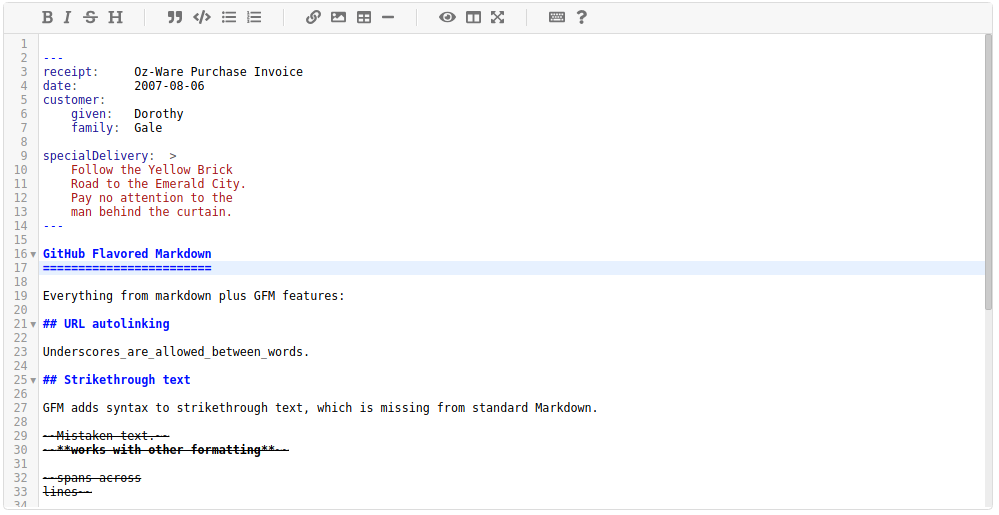
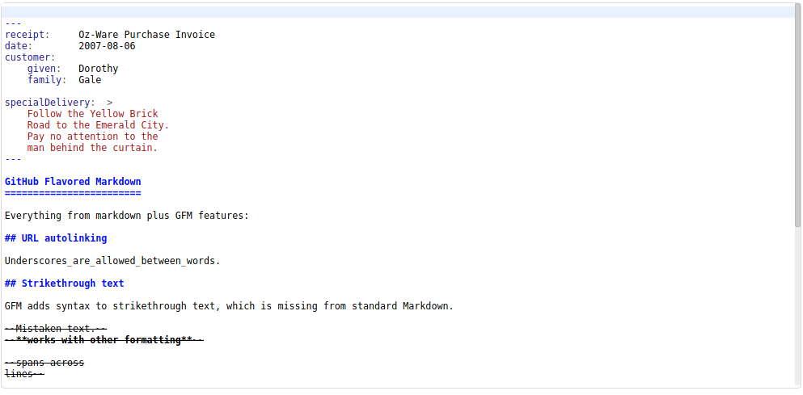
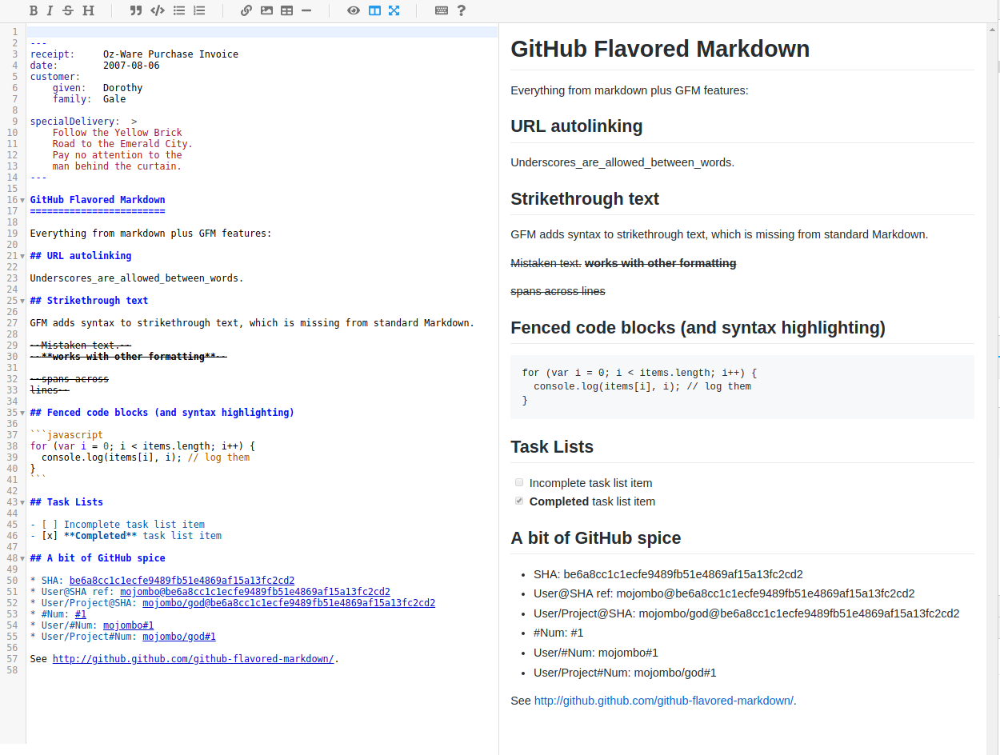
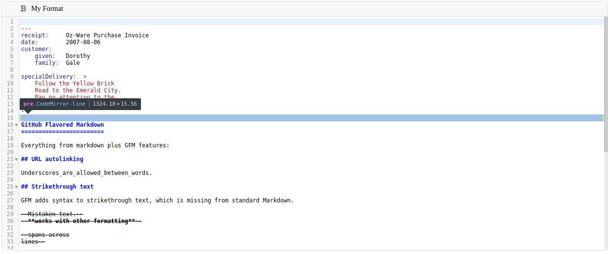

# ReMarkdown

## Introduction

ReMarkdown is a professional grade React markdown editor based on CodeMirror, for programmers and professional tech writters.

It provides following features for more sophiscated markdown editing:

- Frontmatters, YAML / TOML /JSON, which is the main reason for devloping ReMarkdown
- Keymap, Vim / Sublime / Emacs, and obviously default
- Line numbers
- Block folding
- Preview / Fullscreen / Editing and live preview
- Search and replace
- I18n, with build zh-CN ( Simplified Chinese ) suppport. Developers can provide custom phrases for menu tips / search / replace labels.
- Toolbar / menu: a default menu supporting major markdown formats
- Extensible - it exposes underlying CodeMirror instance and allows you to plugin your own menu, custom preview and low level CodeMirror eventhandlers.

## Built with Typescript

ReMarkdown is built with Typescript. But you don't need TS to use it as a library. Exported types are generated by TSC and provided with the library.

## Demo

### Default Editor with front matter highlighting



### Bare editor - no menu and linenumbers



### Live edit and preview



### Custom menu



### Search and replace


## Quitck start

Clone the repo:

`git clone https://github.com/reactma/remarkdown`

Enter the repo:

`cd remarkdown`

Install dependencies

`yarn`

Run demo:

`yarn dev`

Build library:

`yarn build`

### Install

```
yarn add remarkdown
```

or

```
npm install remarkdown
```


## Usage

### Basic usage

**Important: You must import style sheets or provide your own customization**

```
import * as React from 'react'
import * as ReactDOM from 'react-dom'

/*** Important : You must import style sheets or provide your own customization ***/

import 'codemirror/lib/codemirror.css'
import 'codemirror/addon/fold/foldgutter.css'
import 'codemirror/addon/scroll/simplescrollbars.css'
import 'codemirror/addon/dialog/dialog.css'
import 'codemirror/addon/search/matchesonscrollbar.css'

import 'remarkdown/matchhighlighter.css'
import 'remarkdown/remarkdown.css'
import 'remarkdown/gitmarkdown.css'
import 'remarkdown/keymapmenu.css'

/******** Important ******************/


import ReMarkdown, { IReMarkdownProps } from 'remarkdown'

const initialValue = `
---
receipt:     Oz-Ware Purchase Invoice
date:        2007-08-06
customer:
    given:   Dorothy
    family:  Gale

specialDelivery:  >
    Follow the Yellow Brick
    Road to the Emerald City.
    Pay no attention to the
    man behind the curtain.
---

GitHub Flavored Markdown
========================

Everything from markdown plus GFM features:

## URL autolinking

Underscores_are_allowed_between_words.

## Strikethrough text

GFM adds syntax to strikethrough text, which is missing from standard Markdown.

~~Mistaken text.~~
~~**works with other formatting**~~

~~spans across
lines~~

## Fenced code blocks (and syntax highlighting)

\`\`\`javascript
for (var i = 0; i < items.length; i++) {
  console.log(items[i], i); // log them
}
\`\`\`

## Task Lists

- [ ] Incomplete task list item
- [x] **Completed** task list item

## A bit of GitHub spice

* SHA: be6a8cc1c1ecfe9489fb51e4869af15a13fc2cd2
* User@SHA ref: mojombo@be6a8cc1c1ecfe9489fb51e4869af15a13fc2cd2
* User/Project@SHA: mojombo/god@be6a8cc1c1ecfe9489fb51e4869af15a13fc2cd2
* \#Num: #1
* User/#Num: mojombo#1
* User/Project#Num: mojombo/god#1

See http://github.github.com/github-flavored-markdown/.
`

const atChange = (
  editor: CodeMirror.Editor,
  change: CodeMirror.EditorChange,
  value: string // Changed value
) => console.log(Editor changed >>>>>>>>', editor, change, value)

ReactDOM.render(<ReMarkdown atChange={atChange} initialValue={initialValue} />, document.getElementById('root'))
```

### Advanced

#### ReMarkdown Props

As defined in Typescript interface, follow the comments:

```
interface IReMarkdownProps {
  className?: string  // Your custom class name
  initialValue?: string // Editor initial value
  hideMenu?: boolean // Hidemenu or not, true - hide, false - show
  mode?: { // Editor mode
    name: 'yaml-frontmatter' | 'toml-frontmatter' | 'json-frontmatter' // Frontmatter name, must be one of thme
    base: 'markdown' | 'gfm' // base mode, either markdown or gfm ( Github Flavored Markdown )
  }
  menu?: IReMarkdownMenuItem[] // Your coustom value, continue for more details
  markdownTransformer?: (from: string) => string // Your comstom markdown transformer for preview, as the editor may contain front matter.
  renderPreview?: (props: { value: string }) => React.ComponentElement<any, any> // Your custom preview component
  menuitemTips?: { //Menu item tips, for your local language
    [name: string]: string
  }
  locale?: string //Serach/replace/goto line/ menu tip locale, only support zh-CN now
  lineNumbers?: boolean // show linenumber or not
  helpLink?: string //Link to help page for Help menu item
  atMounted?: (editor: CodeMirror.Editor) => any // Your handler after Remarkdown is mounted. You can get your codemirror instance for lowlevel CodeMirror manipulation
  atUnmounted?: (editor: CodeMirror.Editor, value: string) => any // Your handler after Remardown is unmounted
  atChange?: (editor: CodeMirror.Editor, change: CodeMirror.EditorChange, value: string) => any // Your handler for editor change. 
  codemirrorOptions?: any // Options that will be passed directly to codemirror
  menuItemTips?: IMenuItemTips // Your custom menu tips in your own language
}
```

#### Menu

Remarkdown provides following built-in menus:

```
export type ReMarkdownMenuNames =
  | 'bold' // Bold
  | 'br' // Horizontal ruler
  | 'code' // Code
  | 'eraser' //Erase format
  | 'fullscreen' //Fullscreen mode
  | 'heading' //Headings
  | 'help' //Help page
  | 'image' //Image
  | 'ordered-list' //Ordered list
  | 'quote' //Quote
  | 'italic' //Italic
  | 'link' //Link
  | 'preview' //Preview
  | 'strikethrough' //Strike through
  | 'splitpane' //Splitpane for live edit and preview
  | 'table' //Table
  | 'unordered-list' //Unordered list
  | '|' //Menu item break
```

#### Provide your custom tip for menu item 

Provide menuItemTips prop with following format:

```
interface IMenuItemTips {
  [name: string]: string
}
```

example:

```
{
table: 'Insert table',
bold: 'Set bold'
}
```

#### Build your own custom menus

Provide your own meu props to ReMarkdown

```
menu?: IReMarkdownMenuItem[]
```

IReMarkdownMenuItem type is:

```
interface IReMarkdownMenuItem {
  name: ReMarkdownMenuNames | string // name - if it is one of built-in menu item, your props will be merged to default
  tip: string // menu tip
  className?: string // custom class name
  render?: (props?: IMenuItemRenderProps) => any // Render prop that renders your custom menu item. Continue to find properties of IMenuItemprops
  onClick?: (editor: CodeMirror.Editor, name: string, state: string) => void // Your handler for the menu item if you want to replace the default one.
  link?: string // For help only
}

```

IMenuItemRenderProps type is 

```
interface IMenuItemRenderProps  {
  editor: CodeMirror.Editor // CodeMirror editor
  name: string // name of the menuitem.
  state: string // State of menuitem, if ReMarkdown is able to detect the state, applicable to built-in format menu items only. enabled / disabled / selected
  tip: string // Tip for the custom menu item
}

```

#### Provide your own preview component

You need to provide your own render prop to ReMarkdown:

```
renderPreview?: (props: { value: string, frontmatter: string }) => React.ComponentElement<any, any> // Your custom preview component
```

The value is the editor's entire value, including frontmatter. You need to parse the value on your own. The preset frontmatter is passed in, with values of `yaml-frontmatter` or `toml-frontmatter` or `json-frontmatter`
